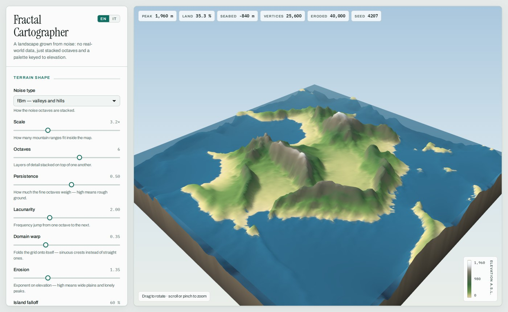

# Fractal Cartographer

A procedural terrain generator that runs entirely in the browser. Simplex noise is stacked into a
fractal field, sampled on a square grid, and coloured by elevation, slope and sea level — the way the
old landscape generators did it, with a few decades of extra ideas layered on top.

**[Open the live demo →](https://danilomagro.github.io/fractal-cartographer/)**



One file, no build step, no dependencies to install. Drop `index.html` on any static host, or
double-click it.

## What it does

- **Fractal terrain** from seeded simplex noise — fBm, ridged and billow modes.
- **Domain warping**, so crests bend and meander instead of running straight.
- **Elevation palettes** — Alpine, Desert, Arctic, Volcanic, Alien — each with its own sky, sun
  colour, water and rock.
- **Slope-aware colouring**: bare rock surfaces on steep faces, vegetation stays in the gentler folds.
- **A real sea level**, with a seabed ramp below it and a translucent water plane on top.
- **Contour lines** every 200 m, drawn at constant apparent width by dividing by the local gradient.
- **A solid block**, not a floating sheet: the terrain sits on a plinth with banded strata down the sides.
- **Hydraulic erosion** — tens of thousands of simulated raindrops carve rills into the slopes,
  sharpen the ridgelines and lay sediment fans along the coast. Runs on demand, with a progress bar,
  and can be undone.
- **Deterministic seeds** — the same number always rebuilds the same world.
- **Bilingual UI** — English and Italian, switchable from the header, remembered between visits.

## How it works

The whole thing is one 1,239-line HTML file — roughly 960 lines of plain JavaScript, 232 of CSS, and
[three.js](https://threejs.org/) from a CDN for rendering.

1. **Noise.** A 2D simplex noise function is built from a permutation table shuffled by a
   `mulberry32` PRNG, so a seed fully determines the landscape.
2. **Fractal sum.** For each grid point, `octaves` samples are summed at rising frequency
   (`lacunarity`) and falling amplitude (`persistence`). Ridged mode folds each octave with
   `1 - |n|`; billow mode uses `|n|`.
3. **Shaping.** The result is raised to an exponent (*Erosion*) — values above 1 flatten the lowlands
   and leave the peaks standing — and multiplied by a radial falloff (*Island falloff*).
4. **Normalisation.** The field is rescaled to `[0, 1]`, so the palette always spans the full range
   whatever the parameters.
5. **Colouring.** Above sea level the normalised height indexes a colour ramp, remapped so the top
   band starts exactly at the chosen snow line; below it, a separate seabed ramp. The local gradient
   blends in rock on steep slopes and darkens the contour bands.
6. **Erosion** (optional, on demand). A droplet is dropped on a random cell carrying direction,
   speed, water and sediment. At each step it reads the interpolated height and gradient, turns
   downhill — blending the new direction with its old one, which is what makes valleys meander
   instead of zig-zag — and moves one cell. Its carrying capacity follows the slope it just
   descended: below capacity it digs, spreading the bite over a weighted disc so no single-cell
   spike forms; above it, or when climbing, it drops the excess. Nothing in the code draws a river —
   the drainage pattern is what tens of thousands of these leave behind. The work is sliced into
   12 ms slices across animation frames, so the page stays responsive and the terrain visibly
   changes while it runs.
7. **Mesh.** Positions and vertex colours are written into pre-allocated typed arrays and reuploaded
   in place, so dragging a slider does not reallocate a single buffer. Colours are converted from
   sRGB to linear because the renderer works in linear space.

## Parameters

| Parameter | What it changes |
| --- | --- |
| Noise type | How octaves are folded: soft hills (fBm), sharp crests (ridged), rounded swells (billow) |
| Scale | Base frequency — how many mountain ranges fit in the map |
| Octaves | How many layers of detail are summed |
| Persistence | Weight of the fine octaves; high values give rough, noisy ground |
| Lacunarity | Frequency ratio between consecutive octaves |
| Domain warp | Displaces the sampling grid by noise, bending crests into sinuous shapes |
| Erosion | Exponent applied to elevation; high values give wide plains and isolated peaks |
| Island falloff | Radial falloff that pulls the map edges below sea level |
| Total relief | Vertical span in metres, from the lowest point to the summit |
| Sea level | Where the water stops, as a fraction of total relief |
| Snow line | Where the top band of the palette begins |
| Palette | Colour ramps, sky, sun and water for the whole scene |
| Grid resolution | 96² to 256² vertices — raise it for detail, lower it for speed |
| Droplets | How many raindrops the erosion pass simulates — a few seconds per 40,000 |
| Erosion rate | How eagerly a droplet digs into the ground beneath it |
| Deposition rate | How readily it drops its load where the slope eases |
| Inertia | How much a droplet keeps its heading; high values meander, low ones take the steepest line |

## Running it

Nothing to install:

```bash
git clone https://github.com/danilomagro/fractal-cartographer.git
cd fractal-cartographer
# open index.html in a browser, or serve the folder:
python3 -m http.server 8000
```

three.js is loaded from cdnjs, so the page needs network access on first load. To make it fully
offline, download `three.min.js` next to `index.html` and point the `<script src>` at it.

## Browser support

Any browser with WebGL and pointer events — tested on current Chrome, Edge and Firefox. Touch works:
one finger orbits, two fingers pinch to zoom.

## What's next

See [ROADMAP.md](ROADMAP.md). Next up: thermal erosion for scree slopes, rivers drawn from droplet
flow accumulation, and parameter permalinks so a landscape can be shared as a URL.

## Licence

[MIT](LICENSE) © Danilo Magro
